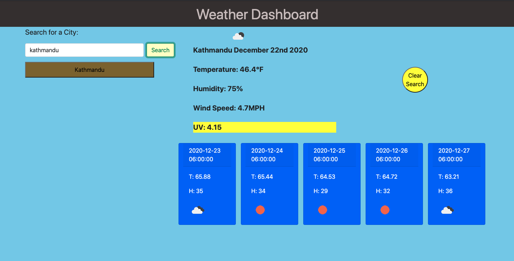

# old-man-weather

This App uses 3 Openweather APIs to generate a forcast for the city searched. Right now, it only gives the weather for the most likely city, as in, a search for San Jose will produce weather for San Jose, California. Not San Jose, Costa Rica. For each search, a button will be generated and stored so you can come back to it. If a button is clicked, the app will treat it as if it were a new search and will generate a new button at the top of the search history list. If to many buttons are generated, merly hit the "Clear Search" button.

Launch Link: https://bh007183.github.io/old-man-weather/